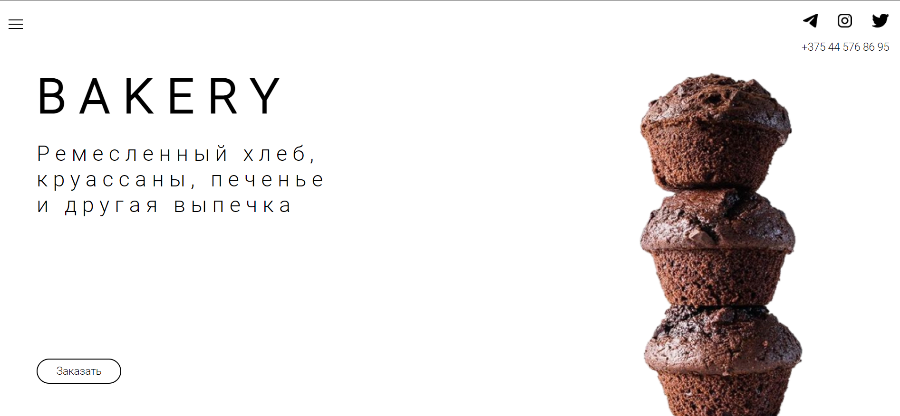

# Landing Page

This repository contains the landing page for a bakery website. The landing page serves as the initial point of contact for visitors and aims to attract their attention, provide essential information about the bakery, and encourage them to explore further or take desired actions.

## Features
The bakery landing page offers the following features:

* Eye-catching Design: The landing page incorporates an appealing and visually engaging design that reflects the bakery's brand identity. The use of high-quality imagery, color schemes, and typography creates a welcoming and appetizing atmosphere.

* Introduction: A brief introduction section on the landing page provides an overview of the bakery's story, values, and mission. It captures the essence of the bakery and intrigues visitors to learn more.

* Product Showcase: The landing page showcases the bakery's signature products, such as freshly baked bread, pastries, cakes, and other delectable treats. High-resolution images and enticing descriptions highlight the quality and variety of the bakery's offerings.

* Special Offers and Promotions: The landing page includes a section dedicated to showcasing special offers, promotions, or seasonal menus. This helps create a sense of urgency and encourages visitors to take advantage of exclusive deals.

* Call-to-Action (CTA): Strategically placed CTAs prompt visitors to take specific actions, such as placing an online order, making a reservation, or subscribing to the bakery's newsletter. Clear and compelling CTAs entice visitors to engage further with the bakery.

* Contact and Location Information: The landing page provides contact details and a map indicating the bakery's location. This makes it convenient for visitors to get in touch, find directions, or visit the physical store.
  
## License
This project is licensed under the MIT License. Feel free to modify and adapt it to your needs.
